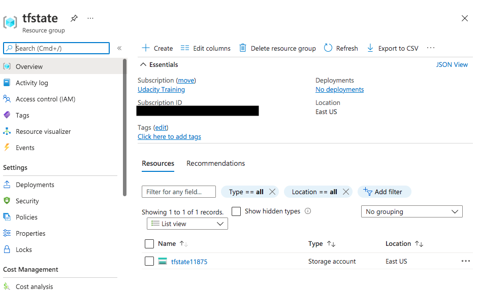
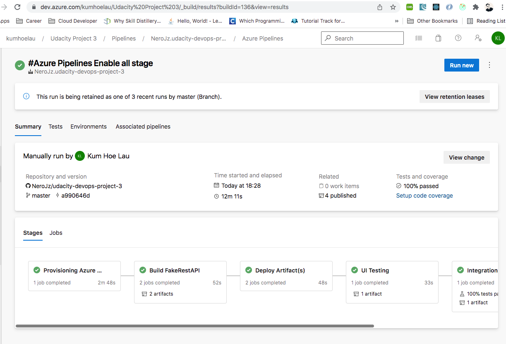
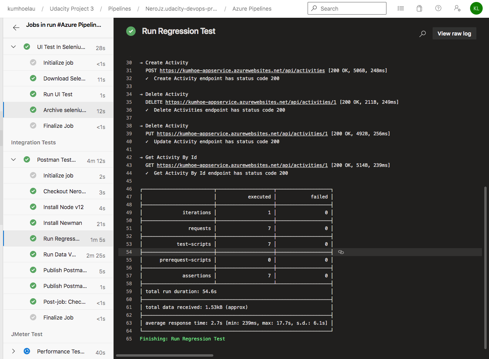

# Udacity Nanodegree Devops Using Microsfot Azure
This project showcase the CI/CD full pipeline using Microsoft Azure. The pipeline ensure quality releases by implementing CI/CD pipeline in Azure Devops service.

## Description
This project implements CI/CD pipeline using Microsoft Azure. The pipeline starts with deploying the Azure resources using IaC. It then follow by deploying the FakeTestApi app. Then, the pipeline will run the Regression Tests and UI Tests using Postman and Selenium respectively. The pipeline also make use the JMeter to conduct performance testing on the FakeTestApi.

## Getting Started
1. Create an Azure Free Account.
2. Create an Azure Devops Account in [here](https://dev.azure.com).
3. Install visual code editor.
4. Install [Terraform](https://learn.hashicorp.com/tutorials/terraform/install-cli).
5. Install [Azure CLI](https://docs.microsoft.com/en-us/cli/azure/install-azure-cli).

## Instructions

### Create Storage Account
1. Make sure login your Azure Account in the terminal using:
```
az login
```
2. Run the create_azure_storage_account.sh
3. Copy these values from the terminal:
    - STORAGE_ACCOUNT_NAME
    - CONTAINER_NAME
    - ACCOUNT_KEY
4. Replace these values to the terraform/main.tf

A new resource group named 'tfstate' shall be created. A blob container will be used to keep track the state of the Terraform when provisioning the Azure resources.

Output:


### Create Service Principal
1. Create the Service Principal by following the documentation from [Azure](https://docs.microsoft.com/en-us/azure/active-directory/develop/howto-create-service-principal-portal).
2. The service principal is an identity created to access the Azure resources.
3. Copy the following settings from the service principal after it had created:
    - Client ID
    - Client Credential/Password

### Create the Azure Analytic Log
1. Run the create-log-analytic.sh to create workspace for analytic log.
2. Copy the workspace ID and primary key from the Azure Portal (based on the VM that you want to link)

3. Save these value in the environment variable of Azure Pipeline

The pipeline uses WORKSPACE_ID and WORKSPACE_PK respectively.


### Terraform
Replace the following property of examples/main_example.tf with the value from Create Storage Account step.

| Property | Value |
| ----------- | ----------- |
| storage_account_name | STORAGE_ACCOUNT_NAME |
| container_name | CONTAINER_NAME |
| key | <ANY_NAME_YOU_PREFFER> |
| access_key | ACCOUNT_KEY |


Replace the following property of examples/terraform_example.tfvars with the value from Create Service Principal.

| Property | Value |
| ----------- | ----------- |
| subscription_id | AZURE_SUBSCRIPTION_ID |
| client_id | CLIENT ID |
| client_secret | Client Credential/Password |
| tenant_id | TENANT_ID |

Rename examples/main_example.tf as examples/main.tf.
Rename examples/terraform_example.tfvars as examples/terraform.tfvars.

Upload both files to the library of Azure Pipeline.


The pipeline will automatically download these files from the library when provisioning the resources.

Remember to remove main_example.tf and terrafprm.tfvars in order not to the expose your Azure account setting.


### Create SSH Key pair
Prior creating the VM, create the [SSH key pair](https://docs.microsoft.com/en-us/azure/virtual-machines/linux/mac-create-ssh-keys).
The public SSH key allows the Azure Pipeline to access the VM which in turn can perform specify tasks like UI testing in the VM.

Once the id_rsa was created, upload the id_rsa to the library of Azure Devops Pipeline:


Once the VM is created, you can access the VM via:
```
ssh <USERNAME>@<IP_ADDRESS_OF_VM>
```


### Deploy to a Linux Virtual Machine
The UI test requires to run the web-chromium within the VM. Kindly refer the official guides [here](https://docs.microsoft.com/en-us/azure/devops/pipelines/ecosystems/deploy-linux-vm?view=azure-devops&tabs=javascript) to setup for VM deployment.

Once the regirstration script is successfully run, the VM will register itself to the environment of Azure Pipeline.

### Upgrade the Python version
The default version of python in the VM (Ubuntu 18.04) is 3.5. The latest PIP does not support Python 3.5. Please install python 3.8
by following the instruction [here](https://tecadmin.net/install-python-3-8-ubuntu/).

## Results
### Overall of the Pipeline


1. Provisioning Azure Resources - Provisioning the Azure resource like creating the app service plan, app service, VM, etc.
2. Build FakeRestAPI - Archiving the testing app and UI test folder to job.
3. Deploy Artifacts - Deploy the FakeRestAPI app and UI test app. This stage also install dependencies like chromium, chromedriver, selenium library into the VM.
4. UI Test - Execute the UI test case with Selenium in the VM.
5. Integration Test - Execute the Postman tests.
6. JMeter Test - Execute the Endurance and Stress tests using JMeter.

### Environment Creation and Deployment

#### Terraform
- Log for Terraform in Azure Pipeline


- Resources in Azure Portal


#### Build/Tests Job
- Build Job



### Automated Testing
- JMeter Test (Endurance Test)


- JMeter Test (Stress Test)


### Function Test
- UI Test in Pipeline

- Archive UI Test


### Integration Test
- Regression Test



- Run Summary Page for Regression Test

- Test Result Page for Regression Test


- Validation Test


- Run Summary Page for Validation Test

- Test Result Page for Validation Test


- Publish Test Result


### Monitoring & Observability
- Screenshots of email received <br/>


- Screenshots of alert rule
